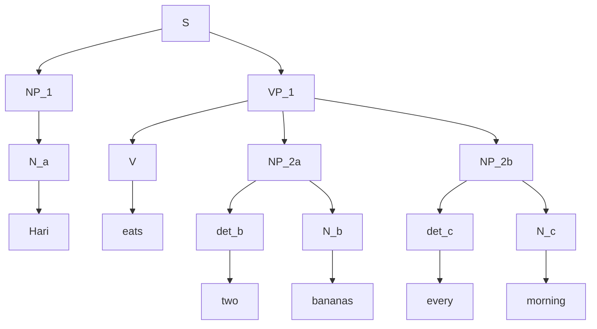
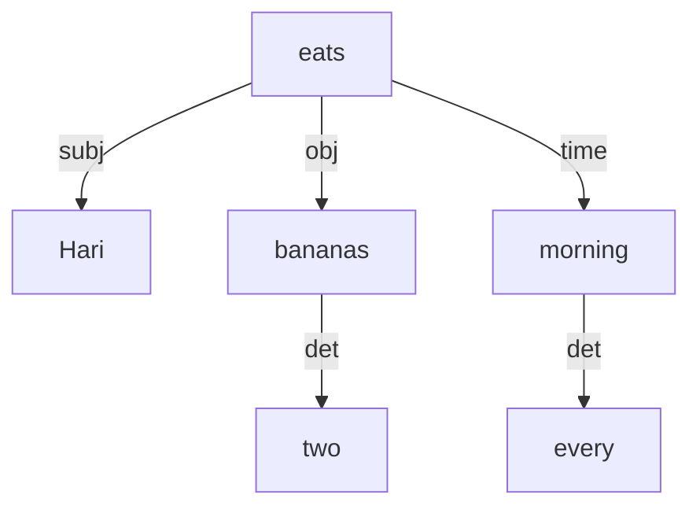

*This is a guest lecture by Prof. Dipti Misra*

## Sentence Structure
Sentences consists of words, each of which belong to certain word classes and have functions within the structure of the sentence.  
Words in sentences often form **constituents**, which can be analysed as single units in addition to their individual members.

### Constituent Analysis and Dependency Grammar
Constituent analysis is based on **Phase Structure Grammar (PSG)**
Here the constituent structure can be represented as a tree, with a heirarchy displaying the relations between the constituents.  

For the sentence:  
*Hari eats two bananas every morning*  
**Phrase Structure Tree**  

In contrast, we have another way of looking at the sentence and the relations between the words in it known as **Dependency Grammar**  
If we were to parse the same sentence that we saw previously, we would get the following:  
**Dependency Tree**  

If we look at the PSG parsing, we note that every word falls under a constituency and the sentence itself forms the root of the tree.  
Each leaf is a word.  
However in dependency grammar, the words form nodes at all levels of the trees and there is one single word which is the root of the sentence.  
*Phrase Structures Trees* preserve the structure, i.e the word order of the sentence, however *Dependency Trees* do not.

The nature of the dependencies is decided on the basis of meaning.
The dependencies capture semantic relations between the words and their dependent.

English has a relatively strict word order that lends itself to working well with PSG parsing, however in recently DG has grown more favourable with those in the field of natural language processing.  
This is because DG firstly works better with languages with more flexible word order, including many ILs, and since it focuses on the relations of meaning.  
Probablistic and Statistical methods which were used to infer data from large databanks have now largely been replaced by machine learning methods.
