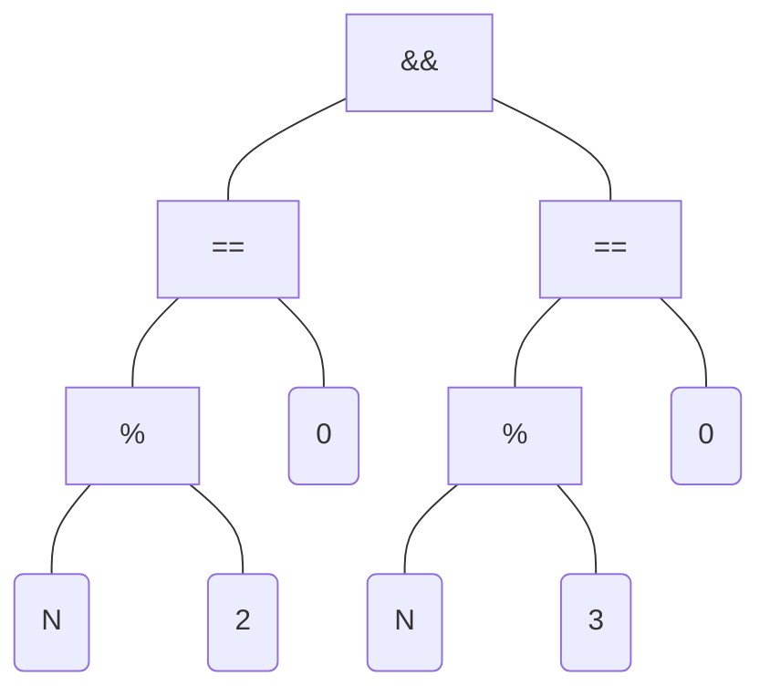

[The lecture recording](https://youtu.be/SCk59yetECM)
## Precedence and expression trees

```c
main()
{
    int N = 6;
    if (N % 2 == 0 && N % 3 == 0)
	printf("N has factors 2 and 3\n");
    if (N % 2 == 0 && N % 3 != 0)
	printf("N has factor 2 but not 3\n");
    if (N % 2 != 0 && N % 3 == 0)
	printf("N has factor 3 but not 2\n");
    if (N % 2 != 0 && N % 3 != 0)
	printf("N has neither factors 2 and 3\n");
}
```

If we look at the above code, and focus in on a certain `if` expression, we can break it down in a **expression tree**, which helps us understand how the expression is parsed, and the relative precedences of the operators in the expression.



The `&&` symbol represents a logical 'AND' expression, which returns a true value if both lhs and rhs are true.
The compiler uses something known as *short-circuit evaluation* in order to optimise such expressions. In the `&&` expression, the lhs expression is evaluated first, and if it comes out to be false, a false value is immediately returned, without evaluating the rhs expression.
This optimization saves computation time, since the rhs expression doesn't matter if the lhs expression is false; the `&&` operator requires both to be true for it to return a true value.

```c
int N = 23;
if ( N++ % 3 == 0 && N % 2 == 0)
    printf("Expression is true");
```
Also consider the above code. Since the left subtree is evaluated first, the value of N tested in the right subtree is is not 23, but 24.

## if-else trees and switch-case

```c
#include<stdio.h>

#define A_CUTOFF 90
#define B_CUTOFF 80
#define C_CUTOFF 70
#define D_CUTOFF 60

int main()
{
    char grade;
    int marks;

    printf("Enter student marks: ");
    scanf("%d", &marks);

    if(marks >= A_CUTOFF)
	grade = 'A';
    else if(marks >= B_CUTOFF)
	grade = 'B';
    else if(marks >= C_CUTOFF)
	grade = 'C';
    else if(marks >= D_CUTOFF)
	grade = 'D';
    else
	grade = 'F';

    printf("Student Grade: %c, ", grade);
    fflush(stdout);

    switch(grade)
    {
    case 'A':
	printf("Excellent\n")
	break;
    case 'B':
	printf("Good\n")
	break;
    case 'C':
	printf("Average\n")
	break;
    case 'D':
	printf("Poor\n")
	break;
    case 'F':
	printf("Failed\n");
	break;
    default:
	printf("Illegal grade\n");
    }
}
```
(talk a bit about above code)

## GDB: GNU DeBugger

If we compile a program in `gcc` using the `-g` flag, it generates extra debugging information for `gdb`
for eg: `gcc -g marks.c`

Now we can open up an executable with the debugger by entering the command `gdb a.out`.
We are greeted with some warranty and licensing information, followed by the gdb prompt:
```
(gdb)
```
We can add a *break point* in front of the main function, where the debugger pauses the program, and then run the program.
```
(gdb) b main
(gdb) run
```
(more on gdb)
