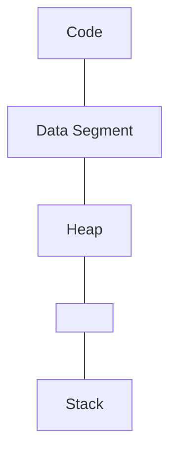

## Storage Layout of a Program

### Virtual Address Space Layout of a Linux Process

There is a specific memory setup for each process. Each process has a **stack** and a **heap** in memory.

First of all, we have a read only segment, which contains the program instructions, and a read/write segment, which contains the global and static local variables. 
Both of these are loaded from the program executable.

Then we also have the **heap** memory, memory in which can be allocated by `malloc` calls. We shall study heap in greater detail later.

Local variables and function parameters are stored in the **stack**. The stack memory is mostly handled by the.

Each process only sees its own virtual address map, which is randomly allocated to some physical memory block by the OS.
This means that for each normal process, things outside its virtual memory are inaccessible to it, and it is effectively **sandboxed**.

If we run the same executable twice in gdb, we see that a variable in the program is located at the same memory address in both the processes. This is possible because these memory addresses are the **virtual memory addresses**.

### Call stack

When we call a function, it gets pushed onto the top of the call stack, with its parameters if any. Once we reach the end of the function and get its return value (if any), this value is sent to where the function was called, and the function is then pushed off the top of the stack.
This behaviour of the function call stack, where the most recently called functions are executed first is essential to **recursion** about which we shall learn more later
